# 🚁 Building the Stallion VTOL – Our Experience Report

*O. Alobaid, M. Daoud Agha, C. Diffenhard, O. Weigelt*

*HSRM – Unmanned Aerial Vehicles Module · Winter Semester 2024/2025*

## Table of Contents

1. [The Idea](#the-idea)
2. [What Flightory Gives You](#what-flightory-gives-you)
3. [Our Optimizations](#our-optimizations)
4. [How We Approached the Build](#how-we-approached-the-build)
5. [Assembly – What Actually Happened](#assembly--what-actually-happened)
6. [Challenges During Construction](#challenges-during-construction)
7. [Electronics Assembly](#electronics-assembly)
8. [Programming with ArduPilot](#programming-with-ardupilot)
9. [Ground Test Results](#ground-test-results)
10. [Final Thoughts](#final-thoughts)
11. [Thanks](#thanks)

## The Idea

We are four students who set out to build a 3D-printed Stallion VTOL drone based on Flightory's design — but not just replicate it. From the start, we wanted to push it further. Our main goal was to increase the drone's payload capacity, and to do that we designed a cargo case that can be transported securely beneath the aircraft. This meant rethinking parts of the structure, optimizing several components, and dealing with a lot of challenges we didn't fully anticipate going in.

## What Flightory Gives You

The Stallion VTOL is a tiltrotor drone built on a tricopter layout — two tilting front motors and one fixed rear motor. It's made from lightweight materials like LW-PLA and PETG, spans 1,340 mm, measures 990 mm in length, and cruises at 60–70 km/h with a takeoff weight of 2,000–3,000 g according to Flightory.

Flightory provides STL and STEP files for printing, a build guide, and a recommended parts list:

| Component | Recommendation |
|---|---|
| Motors | Emax ECOII 2807 1300KV or T-Motor F90 1300KV |
| Propellers | 7×4, 7×5, or 7×6 (2× CCW, 1× CW) |
| Servos | PowerHD 1810MG or GDW DS041MG |
| ESC | Emax Formula 45A BLHeli32 or Lumenier 51A |
| Battery | 4S Li-Ion max. 4S3P 10.5 Ah or comparable LiPo |
| Lighting | WS2812 ARM LED strips |
| Bearings | 3×8×4 mm flanged bearings ×2 |
| Hardware | M3 screws, nuts, washers |

We didn't stick to all of these — more on that below.

## Our Optimizations

### Cargo Case
We designed a case in Autodesk Fusion 360 that slides onto a rail system we modeled directly into the fuselage. The whole thing is 3D printed to keep it as light as possible while still being structurally solid.

### Motors
We went with more powerful motors — 23.4 g heavier per unit than the recommended ones, but delivering 621.9 W more power each. The extra current draw is compensated by the upgraded battery.

### Battery
Our batteries are 90 g heavier than the standard option but offer 2,200 mAh more capacity and a 20C higher discharge rate. The idea was to maintain decent flight time despite the added weight of the payload.

### Propellers
We swapped the 7-inch 2-blade props for 8-inch 3-blade variants. Three blades give better stability — important when carrying cargo — and the larger diameter adds meaningful thrust. The slight increase in drag is negligible compared to the gain.

### ESC
We chose a 4-in-1 ESC to save weight and free up space inside the fuselage. The compactness makes a real difference when you're trying to fit everything inside.

### Servos
High-torque servos were a must with the larger motors and propellers, especially given the aerodynamic loads on the tilt mechanism.

### FPV Camera
We added an optional FPV camera — a cost-effective alternative to the suggested model that does the same job.

> For the full parts list with prices and weights, see [P1_shopping_list.md](P1_shopping_list.md)

> Further Links see [P1_links_parts_tutorials.md](P1_links_parts_tutorials.md)

## How We Approached the Build

We kicked things off with a brainstorming session to plan out the optimizations and divide up the work. Here's roughly how it unfolded:

**Preparation** — 3D files were imported into Fusion for analysis while components were being sourced. Once we placed the order, we started adapting the 3D models to include the cargo case and rail system. Unmodified parts were sliced in Cura and BambuStudio in parallel.

**First assembly** — Once the first prints came off the bed, we started fitting parts together and gluing them. 3D printing inaccuracies showed up almost immediately and required a lot of manual correction — filing, drilling, cutting, the works. More on that in the challenges section.

**Electronics installation** — After the fuselage, wings, and tail were done individually, we moved on to servos and motors. Cables were extended with crimp connectors and routed through the channels. While waiting for the remaining components to arrive, we primed and painted the drone.

**Programming** — Once everything was installed, connected, and soldered, we programmed the flight controller using ArduPilot and ran ground tests.

## Assembly – What Actually Happened

After printing all the parts and weighing them, we laid everything out for a first overview. Then the gluing started.

  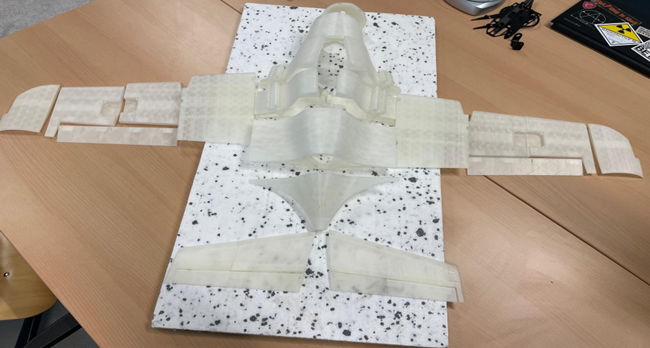

The fuselage went together following Flightory's instructions — but printing inaccuracies showed up right away. A lot of manual reworking was needed before things actually fit. The carbon tubes then had to be cut and sized, and the tail fins and wings were test-fitted before being properly attached.

  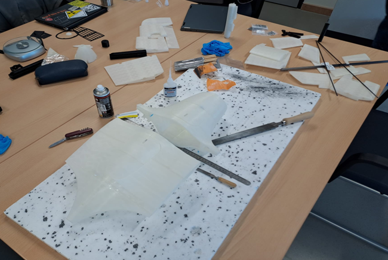

Servo and motor installation came next. We had to shorten parts and drill extra holes for cable routing. Once cables were extended and routed, the control surfaces were attached using polyester hinges and eventually linked to the servos via small metal push rods.

  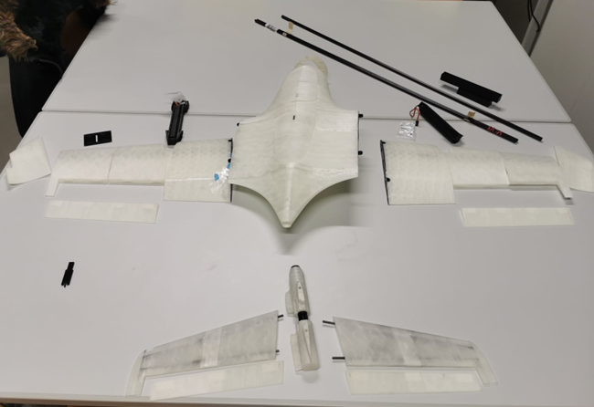

Since the flight controller and ESC hadn't arrived yet at this point, we used the downtime to paint. Motors and servos were masked off, the drone was primed, and a matte white coat was applied. The university logo was stenciled onto the wings and degree program stickers went on in a few spots.

  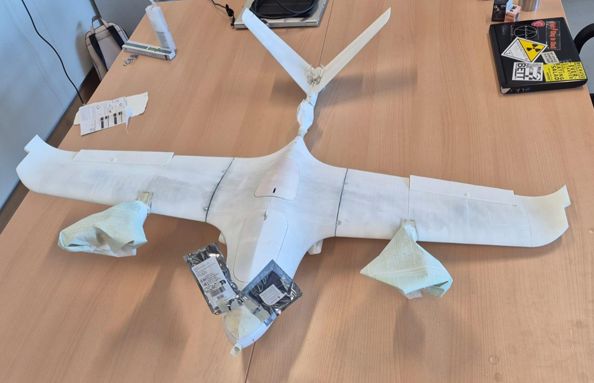

  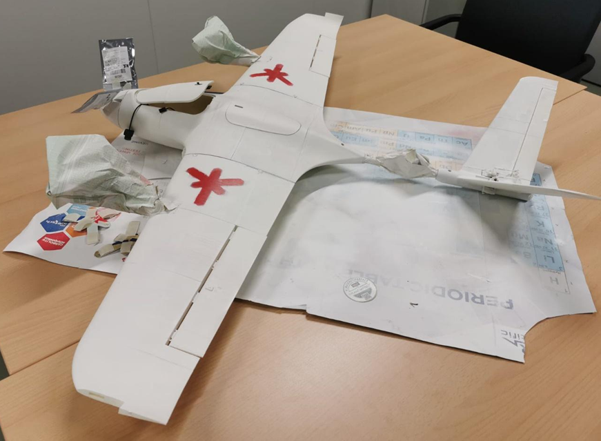

## Challenges During Construction

Honestly, we ran into issues almost constantly. Some caused real delays.

**STL vs STEP files** — Flightory only provides some parts as STL files, not the editable STEP format. Getting these into CAD for modification took multiple steps: import as mesh → repair the mesh → convert to a solid body → manually fix surface irregularities. Not the end of the world, but time-consuming.

**Payload rail design mistake** — When we added reinforcing struts inside the fuselage for the rail system, we didn't notice they were blocking where carbon tubes needed to pass through. Only caught it after printing. Holes had to be drilled post-print.

**3D printing inaccuracies** — This was probably the single biggest time sink. Parts that didn't fit right had to be re-glued, and separating CA-glued parts without breaking them is genuinely difficult. Some parts had to be reprinted entirely. Nearly every hole and channel needed post-processing before components would fit.

**The build guide** — Flightory's instructions are... thin. Complex steps like connecting flight controls with hinges and servos are sometimes described in a single sentence with no photos. You spend a lot of time guessing.

**Screws and bearings** — No screw lengths are specified anywhere, so you're just trying different ones until something works. Ball bearings for the motor mounts aren't mentioned at all until you're mid-build and suddenly need them for the next step.

## Electronics Assembly

With the bearings finally in hand, the servos and tilt motor assemblies could be fully completed. Motor mounts were screwed to the booms, connected to the servos, and attached to the wings. 

  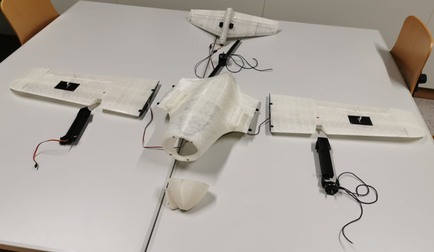

Cables for motors and servos were extended to reach the center section. Servo cables plug straight in; motor cables needed crimp connectors. Everything was then fed through the channels and the full wiring harness came together inside the fuselage.

<table>
<tr>
<td>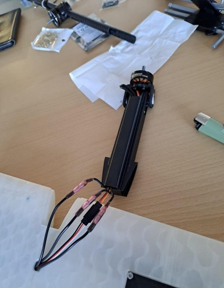</td>
<td>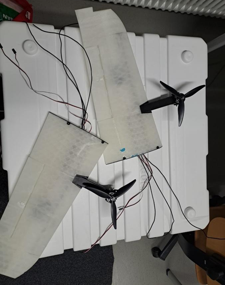</td>
</tr>
</table>

The GPS/compass module, camera receiver, and RC receiver were connected to the flight controller. The ESC was soldered to the battery, FC, and motors as required. 

  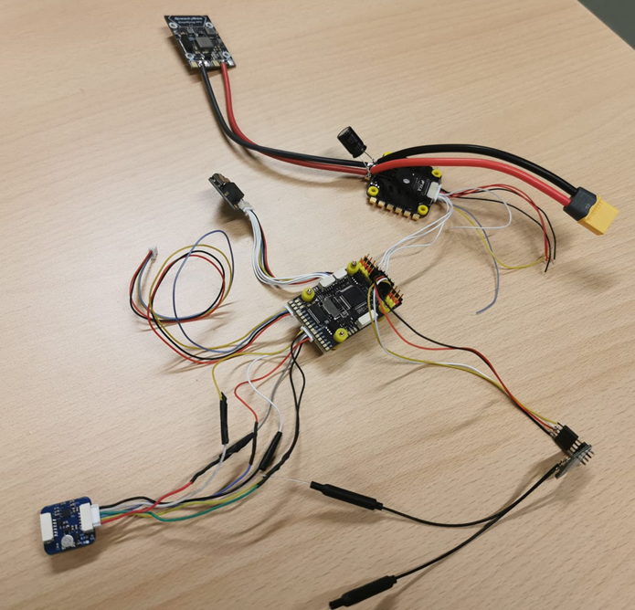

 

Control surfaces and servos were linked via pushrods. LED cables were extended and connected.

  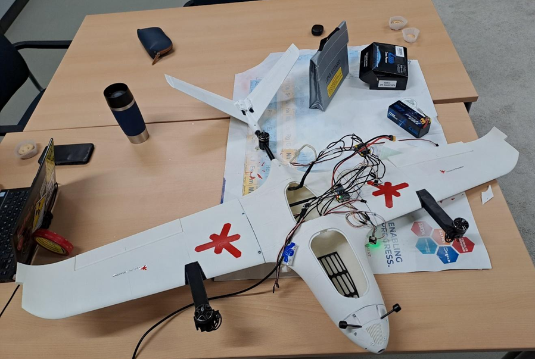

### Challenges
---

**No wiring documentation** — Flightory provides zero guidance on how to wire the electronics. The only mention is that the drone has enough space for them.

**Barely any online resources** — Building a VTOL from scratch is niche enough that helpful documentation is essentially nonexistent.

**Component incompatibility** — Nothing is standardized. Most connectors didn't match, or were missing entirely. Plugs had to be cut, wires re-soldered in crossed configurations to get the correct pin assignments. Even the battery cables were incompatible with standard chargers. The FC was sold as "plug and play" — a term we now interpret very loosely.

**Cable channels** — Too narrow. Several cables broke during routing and had to be replaced. We ended up bundling everything with heat-shrink tubing to make it manageable.

**Faulty servo on delivery** — One servo arrived defective, had to be swapped out and re-cabled.

## Programming with ArduPilot

The FC shipped with INAV, so the first step was flashing ArduPlane to enable VTOL behavior. After that it was connected via USB-C to Mission Planner.

Parameters were configured and written to the controller. Then we headed to the university courtyard for sensor calibration — GPS needed an open sky, and the compass had to be calibrated away from interference. That part actually went smoothly and felt like a small victory.

  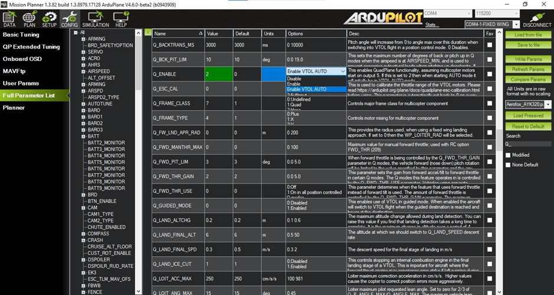

  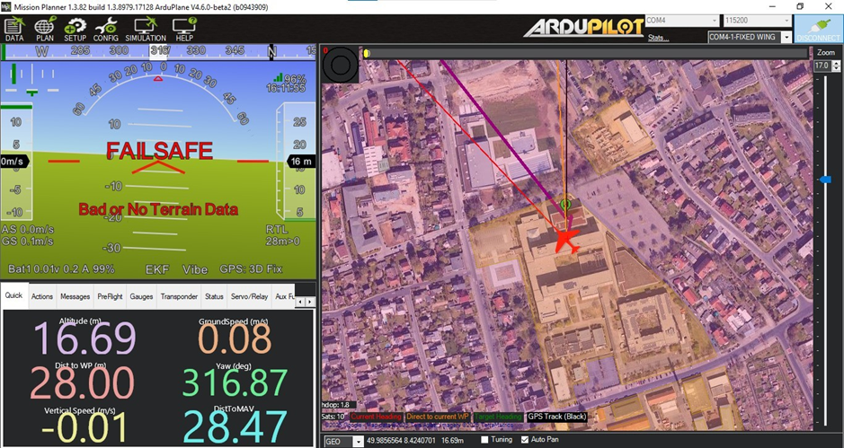

Servo outputs were assigned, connected to the correct FC pins, and tested using a custom-built servo tester from the IT lab (thanks Mr.H!).

  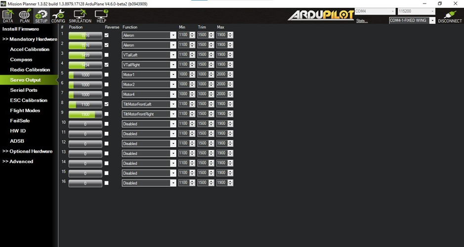

 

The RC transmitter and receiver were both flashed with the latest EdgeTX and ELRS firmware, paired with a shared passcode, and connected automatically on power-up.v

  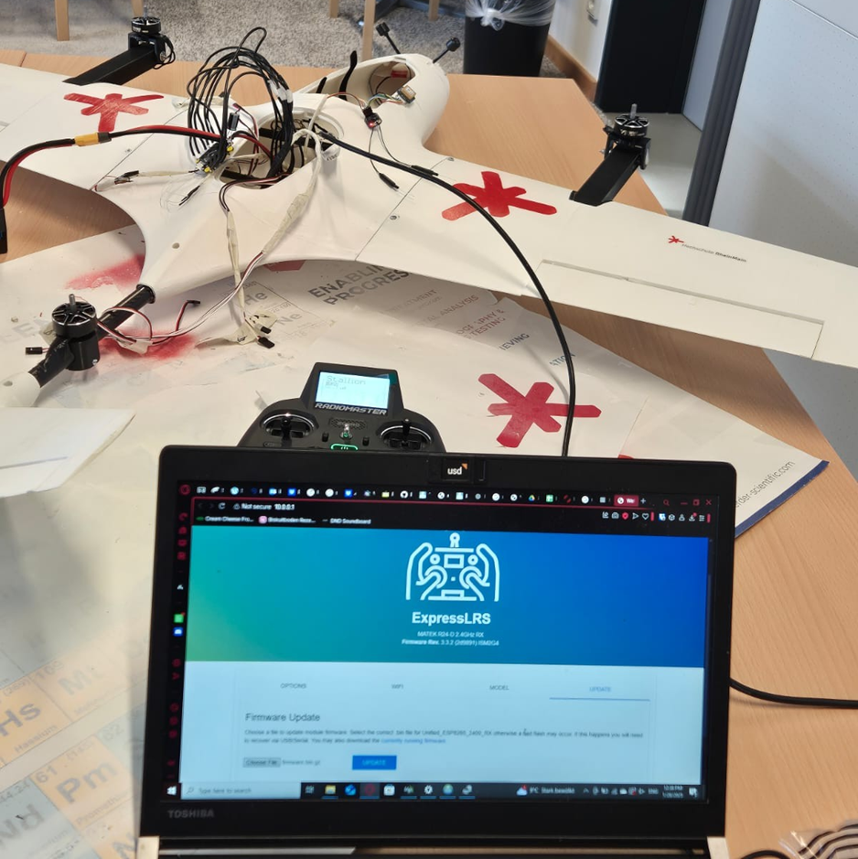

Control surface testing went well — V-tail, ailerons, and tilt rotors all responded correctly. The motors, unfortunately, still couldn't be controlled at this point. The IT lab was closing that evening and the report deadline was the same night, so we had to stop there.

### Programming Challenges

**INAV ≠ ArduPilot** — The FC is sold as ArduPilot-compatible, but it ships with INAV and can't be directly flashed with ArduPilot. You have to flash ArduPilot via the INAV Configurator first. This isn't documented anywhere.

**11 hours chasing a firmware bug** — QuadPlane parameters simply didn't work and the ESCs were stuck in standby beeping constantly. We tried everything: different firmware versions, different pins, multimeter measurements, BLHeli32 Suite, parameter changes. Nothing worked that day.

The next day we tried the unstable firmware version — and everything appeared immediately. The parameters had apparently just been removed from the stable release. Not documented anywhere. A day of work lost on something that took minutes to fix once we knew.

**DSHOT "not supported"** — The FC manual said DSHOT1200 wasn't supported. After extensive digging, we found it's actually available and just needs to be enabled via a parameter. The manual was simply wrong.

**RC firmware update** — The official GitHub instructions for updating the RC firmware didn't work. We eventually succeeded by doing a Wi-Fi update instead — figured that out ourselves.

**Servo self-destructed** — During a servo test, one tilt rotor servo moved without any input, hit the boom, stripped its gears, and was completely destroyed within seconds. Our last spare had to be installed.

## Ground Test Results

**Flight control** — Works. Ailerons and V-tail move correctly via the remote. The tilt rotors respond to commands (though full tilt behavior needs airspeed to verify). Automatic stabilization kicks in when you tilt the drone by hand. LEDs indicate status correctly.

**Motors and ESC** — Unresolved at the time of the deadline. We'll keep working on it, just not documented here.

## Final Thoughts

This was a genuinely challenging project that pushed us in directions we didn't expect. The hardware is exciting, but the reality is that documentation — from Flightory, from component manufacturers, from the ArduPilot ecosystem — is often patchy, outdated, or just missing. A big part of the project ended up being detective work.

What we built: a structurally complete, painted, and largely functional Stallion VTOL with a custom payload rail system and cargo case, all sensors calibrated, flight controls working, tilt rotors responding. The motor/ESC issue is the remaining open thread.

What we took away: hands-on experience across mechanical assembly, electronics integration, firmware flashing, CAD modeling, and embedded systems troubleshooting.

  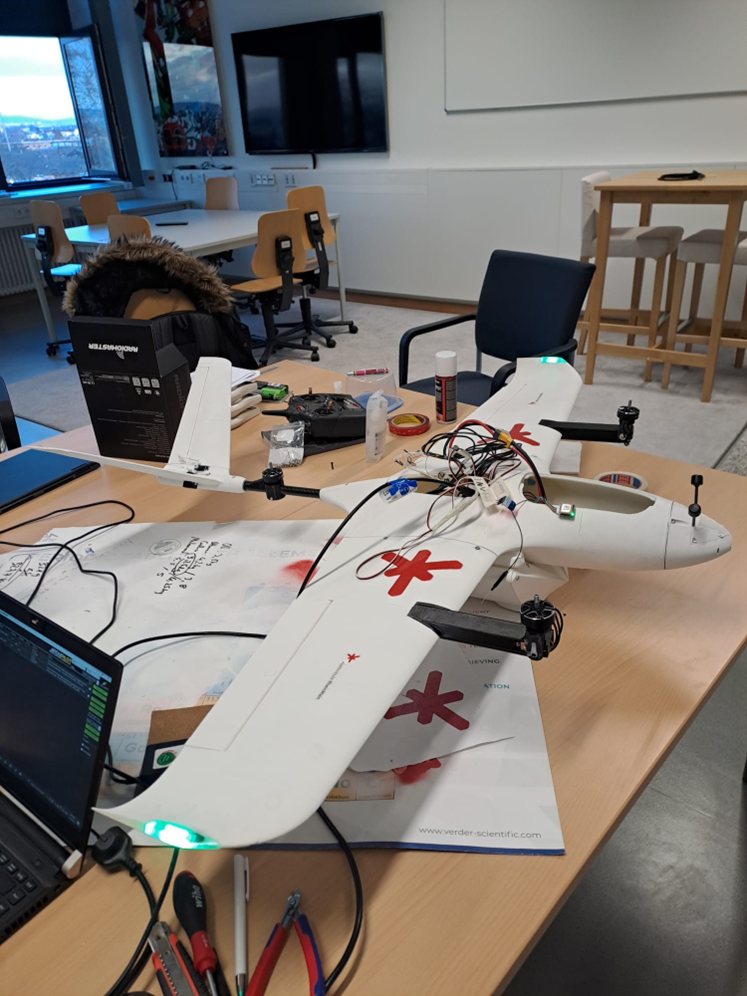

---

## Thanks

To everyone at HSRM who supported this project — lecturers, IT lab staff, and fellow students.

## 📝 Source
Personal experience, HSRM UAV project, Winter Semester 2024/2025*
