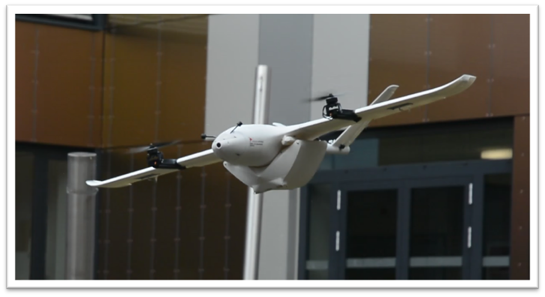
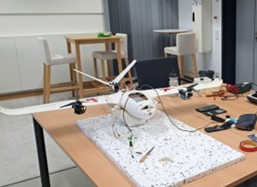
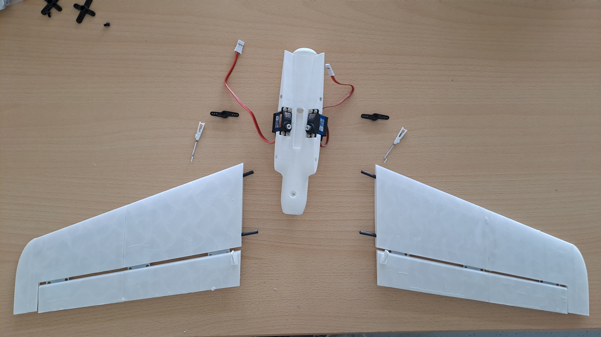
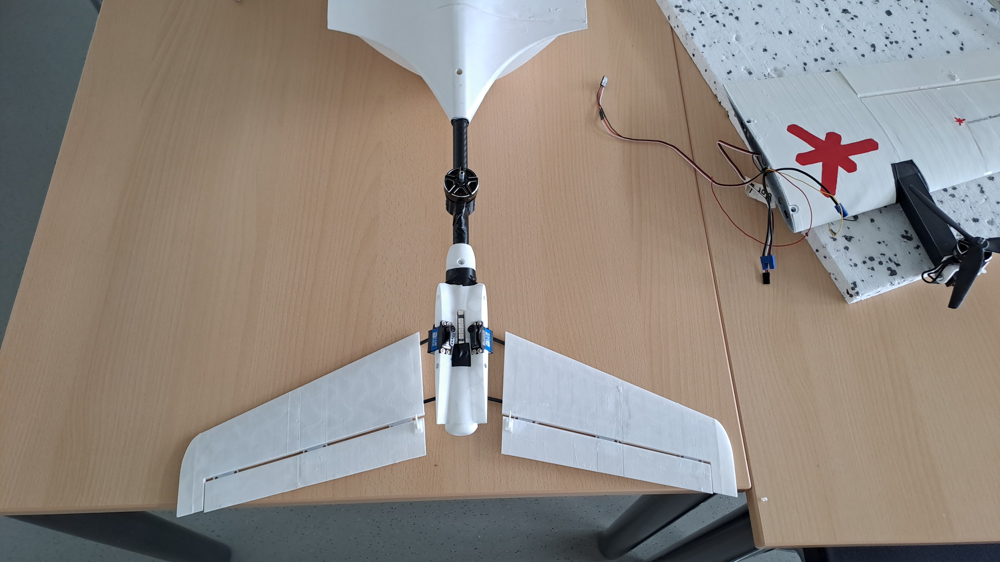
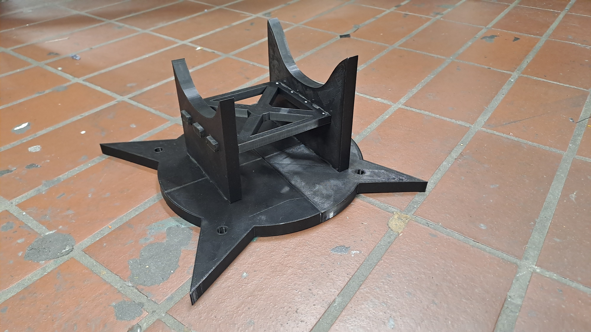
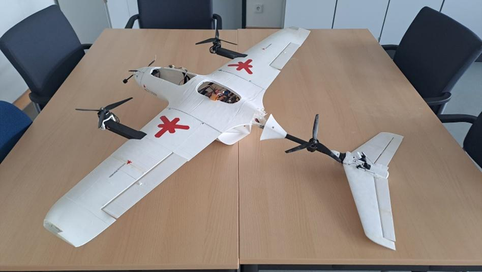

# 🚁 Stallion VTOL – Final Project Report

*HSRM – Avionics Module · Summer Semester 2025*

# *The Dream of (Horizontal) Flight*

## Table of Contents

1. [Introduction & Goals](#introduction--goals)
2. [Technical Background](#technical-background)
3. [What We Did & What We Found](#what-we-did--what-we-found)
4. [Summary](#summary)
5. [Open Points & Outlook](#open-points--outlook)
6. [Sources & References](#sources--references)

## Introduction & Goals

This project picked up directly where the previous semester's UAV build left off. The Stallion VTOL was mechanically and electronically complete, but a remaining software issue was preventing actual flight. The goal this semester was to resolve that, get the drone properly airborne, and take the whole system a step further.

**Concrete objectives:**

- **Finalise flight capability** — systematic fault-finding and resolution of the software issues blocking motor control
- **Electronics modularisation** — clean, maintainable wiring with clear separation of functional modules
- **Flight testing & parameter tuning** — structured test flights including tuning for hover stability and transition to forward flight
- **Forward flight** — first controlled forward flight passes to assess horizontal flight behaviour
- **Technical optimisation assessment** — evaluate the real-world impact of our component upgrades (motors, props, CG)
- **Payload flight tests** — determine maximum useful payload through defined load tests, assessing stability and power consumption under load
- **Autonomous flight exploration** — set up PC-based mission planning and run initial automated flight sequences (e.g. waypoint missions)
- **Documentation** — complete technical documentation of all systems, work steps, tests and results as a foundation for future development

## Technical Background

The Stallion VTOL from last semester's project, with the following installed components:

| Component | Specification |
|---|---|
| Motors | T-Motor Velox Victory V3008 1350KV |
| Battery | Zeee 4S LiPo 14.8V 120C 7200mAh XT90 |
| Flight Controller | T-Motor F7 FPV FC |
| ESC | T-Motor F55A Pro II 4-in-1 2S–6S DShot BLHeli32 |
| Servos | GDW DS041MG / Corona Servo CS929MG |
| LEDs | SpeedyBee Programmable 2812 Arm LEDs |
| Propellers | Gemfan CL 8040 Cinelifter 3-blade 8" |
| Transmitter | RadioMaster Zorro ELRS |
| Receiver | Matek ELRS 2.4G Dual |
| FPV System | Walksnail Avatar HD Kit V2 (Dual Antenna) |
| Goggles | Walksnail Avatar HD FPV Goggles L |
| Body | Lightweight PLA (3D printed) |

The project benefited significantly from the support of the IT lab at HSRM — tools, chargers, cables, adapters, and workshop equipment were all on hand.

Picking up from last semester also meant carrying forward hard-won knowledge across electronics, CAD, ArduPilot configuration, ELRS firmware, Mission Planner, and soldering. These skills were essential from day one.

## What We Did & What We Found

### 1. Project Kickoff & Goal Definition
We started the semester by laying out everything that still needed doing. A to-do list was compiled, project goals were defined around modularisation, flight readiness, and stability, and the wiring was tidied up with a rough concept sketch to guide the work ahead.

### 2. Motor Activation — First Technical Breakthrough
The first real hurdle was getting the motors to actually respond. Despite Mission Planner showing a successful arm indication, the motors stayed silent — it turned out a physical arm/disarm switch had never been configured on the transmitter. Once we added the switch and linked it to the correct ArduPilot function, everything clicked into place: the system armed, the motors spun up at idle, and throttle inputs from the transmitter produced the expected response. It was the first time the full control chain had worked end to end.

### 3. Flight Test 1 — First Hover
The drone lifted off for the first time. In the air it was clear that the pitch and roll axes were inverted, which made control awkward, and strong oscillations around the yaw axis made yaw particularly difficult to manage. Despite all of that, the pilot managed to complete several takeoffs and landings without causing any structural damage — a promising start given the state of the parameters.

### 4. Battery & Thrust Analysis
In parallel with the flight work, we ran a proper analysis of the power system to understand what we were actually working with. A luggage scale was ordered for thrust measurements and weight calculations were done to assess whether the planned new battery was even feasible. The results confirmed the system had enough headroom — at 80% throttle the three motors together produce 7.79 kg of thrust at 124.5 A total draw, and cruise at 60% throttle sits around 61.5 A. One important constraint: 100% throttle is only sustainable for roughly 8 seconds, so hover and climb need to be achievable at well below that. With the current 4S setup the all-up weight came to 3.236 kg; switching to the new 6S 17 Ah battery would push that to 4.533 kg — still within the thrust envelope, but leaving less margin.

| Condition | Thrust | Current Draw |
|---|---|---|
| 80% throttle (max usable) | 7.79 kg | 124.5 A |
| 60% throttle (cruise) | — | 61.5 A |

| Component | Weight |
|---|---|
| Empty drone | 2.203 kg |
| Cargo case | 0.480 kg |
| Current battery (4S) | 0.553 kg |
| **Current AUW** | **3.236 kg** |
| With new 6S battery (1.85 kg) | **4.533 kg** |

### 5. Flight Test 2 — Parameter Tuning
The second flight was conducted in windy conditions, but the improvement over the first was immediately obvious. The control axes were no longer inverted, yaw behaviour was significantly better, and the drone handled multiple flight cycles without issue. The tuning was clearly working. Two things still needed attention: the tail servos were making audible overload sounds under load, signalling they needed to be replaced, and yaw still drifted slightly back when the stick was released. Post-flight, the battery and ESCs were hot enough that touching them without protection wasn't an option — thermal management was flagged as an open concern.

### 6. CAD Work & Parameter Optimisation
Between flights we used the time to design a landing gear and an enclosure for the ESC and flight controller in Fusion 360. Parameters were also refined further based on what the test flights had shown.

### 7. Flight Test 3 — Two Crashes
The third session started well but ended badly, twice. During a landing the drone simply fell out of the air after switching from QStabilize to QHover at about 2 m — motors cut out completely, the cargo case took the brunt of the impact, and the battery was found warm and unevenly discharged. No structural damage, but the suspected cause was thermal or voltage-related. The second crash was more dramatic: immediately after takeoff in QHover, the drone yawed hard toward the pilot without any stick input and accelerated forward. It hit a bench, the pilot, and a sign stand before the emergency stop was triggered. The most likely explanation was a GPS position mismatch — the pre-flight GPS check had been disabled for test purposes, and the FC may have tried to correct to a position it had never actually confirmed. The outcome was significant structural damage: tail, servo arm, propellers, and wing surfaces all needed attention.
Thankfully the pilot was not injured albeit a bit shaken. 

### 8. Damage Documentation & Safety
Every piece of damage was photographed and logged. We also used this moment to create a proper pre-flight checklist — something that should have existed earlier — to make sure the conditions that led to both crashes couldn't repeat themselves.

### 9. Repair & Modularisation
Damaged parts were removed and either reprinted or reordered. The repair became the natural moment to finally carry out the electronics modularisation we'd been planning. Motors were rewired with bullet connectors so each one is individually disconnectable; servos were connected via jumper cables for easy removal from the FC; and a central electronics box was built to allow the whole electronic assembly to be pulled out and reinstalled quickly. The tail was fully rebuilt, wing surfaces were filled and sanded, and the wiring was re-routed cleanly throughout. 

### 10. VTX Integration
With the new tail assembled and the electronics modularised, the VTX was connected and successfully paired with the FPV goggles. The battery hatch was modified to accommodate the larger 6S battery. One issue that became apparent immediately: the VTX runs extremely hot during ground operation, reaching temperatures that triggered an overheat warning in the goggles within minutes. Active cooling on the ground is essential before any flight. On a more positive note, the older 4S batteries that were no longer needed for the drone turned out to work perfectly as a power source for the goggles.

### 11. Further Build & Electronics Finalisation
The ESC/FC enclosure and landing gear were printed and installed. The VTX, receiver, and camera were all mounted on a removable rail to use the fuselage space efficiently. An SD card for error logging was added to the FC, and a second SD card for video recording was installed in the camera and tested successfully — real-time video transmission wasn't possible, but onboard recording worked well. A WiFi connection to Mission Planner was set up, enabling motor tests, servo trim, and flight data to be accessed remotely from a ground PC.

### 12. New Battery Integration & CG Testing
Integrating the new 6S 17 Ah battery required modifications to the battery bay to get it to fit. The heavier battery shifted the centre of gravity significantly forward, and a CG test confirmed that around 350 g of counterweight was needed at the tail to bring it back within the safe range. Despite the added mass, the drive system had enough thrust to remain viable for flight.

### 13. Flight Test 4 — Model Airfield (Crash)
The fourth test flight, conducted at a model airfield, ended in a crash immediately after takeoff. At first the drone didn't respond to throttle input at all despite a linear increase in the command — then motor output jumped suddenly to 100%, the impulse was far too abrupt for the flight controller to manage, and the drone flipped. Damage was sustained to the tail and parts of the fuselage, though the electronics appeared undamaged. The most likely causes are a combination of the heavy battery shifting the CG to a critical position, a possible software or signal issue between transmitter and receiver, and VTX-related RF interference — the VTX had already run hot before takeoff.

### 14. Repair Documentation
All damage from the airfield crash was documented and a detailed repair guide produced to bring the drone back to its previous state — see [Repair Guide](P2_repairguide.md).

## Summary

A modular UAV system was developed, built, and tested across multiple flight phases this semester. Key milestones and findings:

**What worked:**
- Motors activated and responding to throttle after arm switch was configured
- Stable hover achieved through parameter tuning — from strong oscillations on the first flight to clean, controlled hover
- Full modularisation of electronics completed
- SD card error logging and video recording both functional
- WiFi Mission Planner connection successful

**What didn't go to plan:**
- Significant thermal load on battery and ESCs during extended hover — active cooling is needed
- Two crashes from thermal overload and GPS-related issues caused structural damage that required a full repair cycle
- Final flight test ended in a flip — likely a combination of weight, CG, thermal interference, and a motor response anomaly

**Where things stand:** The drone is currently damaged and not airworthy. A full repair is required before further flights can be conducted.

## Open Points & Outlook

**Immediate next steps:**
1. Full repair of crash damage (tail, fuselage segment) — see [Repair Guide](P2_repairguide.md)
2. Evaluate whether the current 6S 17 Ah battery is viable or a lighter option should be used
3. Alternatively: structural modifications to handle the battery weight and keep CG stable

**Once repaired:**
- Hover flight tests to verify stability
- Transition to forward flight with VTX/FPV
- First autonomous waypoint missions via ArduPilot Mission Planner

**Longer-term potential:**
- Integration of mission-specific sensors (surveying, monitoring, inspection)
- Design of a V2 airframe optimised for the challenges identified this semester:
  - Larger fuselage for heavier batteries
  - More powerful drive system
  - Additional interior space for payload or sensors

The project has genuine development potential — both in the academic context and toward real-world application. A clear strategic direction for the next team will be essential to make the most of what's been built and learned.

## Sources & References

- [T-Motor Velox V3008 motor data](https://www.mepsking.shop/tmotor-velox-v3008-cinematic-fpv-drone-motor.html)
- [ArduPilot — QuadPlane VTOL Tuning](https://ardupilot.org/plane/docs/quadplane-vtol-tuning-process.html)
- [ArduPilot — Tilt Vectored Yaw Tuning](https://ardupilot.org/plane/docs/tilt-vectored-yaw-tuning.html)
- [ArduPilot — Tilt Rotor Guide](https://ardupilot.org/plane/docs/guide-tilt-rotor.html)
- [ArduPilot — ESC Calibration](https://ardupilot.org/plane/docs/quadplane-esc-calibration.html)
- [ArduPilot — QuadPlane Parameters](https://ardupilot.org/plane/docs/quadplane-parameters.html)
- [ArduPilot — QuadPlane Flight Modes](https://ardupilot.org/plane/docs/quadplane-flight-modes.html)
- [ArduPilot — QuadPlane Tips](https://ardupilot.org/plane/docs/quadplane-tips.html)
- [Flightory — Stallion](https://flightory.com/product/stallion/)
- [Flightory — Stallion VTOL](https://flightory.com/product/stallion-vtol/)
- [YouTube — Stallion VTOL build reference 1](https://www.youtube.com/watch?v=FiyyzRG6oog)
- [YouTube — Stallion VTOL build reference 2](https://www.youtube.com/watch?v=IFvLQy3KrKs)
- [Oscar Liang — Walksnail Avatar FPV Setup](https://oscarliang.com/setup-avatar-fpv-system/)
- [SpeedyBee F405 Wing FC](https://www.speedybee.com/speedybee-f405-wing-app-fixed-wing-flight-controller/)

---

*Source: Personal experience, HSRM Avionics project, Summer Semester 2025*
