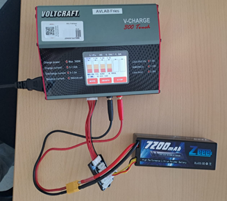
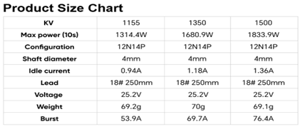
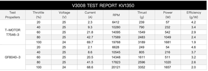

# 📓 Project Logbook — Stallion VTOL
*HSRM Avionics Module · Summer Semester Project 2025*

> **⚠️ Disclaimer:** This logbook is based purely on personal experience and is not a technical manual.
> It's meant as a reference for similar experiences — or simply as a loose guide.

## Starting point: 
We built the drone in Wintersemester 24/25 in the HSRM UAV Module and are now looking forward to improve it 

## 25.04.2025 First Overview 

### 📋 To Dos
- [ ] Self-locking nuts on propellers (UAV lab)
- [ ] Plan electronics modularisation / tidy electronics
- [ ] Order required parts → ask other group
- [ ] Charger / adapter for battery charging
- [ ] Carry out modularisation (UAV lab)
- [ ] Find suitable flight test location → model airfield
- [ ] First flight tests — gather experience on payload, speed, flight modes
- [ ] Parameter fine-tuning
- [ ] Plan a show-off day, compile guest list
- [ ] Documentation — comprehensive project summary: build steps, software settings, manual-style guide

### 📝 Modularisation Notes
**Goal:** Detachable wings, electronics decoupled as modules.

**Modularisation To Dos:**
- GPS, camera, RX mounted so they are removable
- FC & ESC as one decoupled module with stable attachment
  - Custom-fit enclosure / screw-mounted frame
  - Modularity + protection + stability
  - Padding? Cooling?
- Clear labelling — good organisation and documentation
- Battery, servo & LED pluggable out of FC
- Foam feet / mat on landing gear

## To Dos until 30.04.2025

| Task | Owner | Status |
|---|---|---|
| Ask other group about connectors / organise connectors | C | ✅ Done |
| Check battery charger, clarify motor direction in software | O | |
| Find model airfield with power outlet access | | |
| Define concrete flight test objectives | | |

## 30.04.2025

### ✅ Today
First successful test "flight" — new findings.

### 📋 Further To Dos
- [ ] Flexible cables for connection between plug connectors and ESC
- [ ] Rethink / reprint hatch closing mechanism
- [ ] Secure ESC and FC mounting
- [ ] Calibration
- [ ] Test / landing platform with luggage scale for thrust testing
- [ ] More detailed calculations on aircraft power
- [ ] Fleece/carpet on landing platform for soft landing

### 💡 Notes
- Battery charger can be borrowed from Mr. F
- **For 08 May:** Bring ropes to tie drone to table for indoor flight attempts

## 05.05.2025

### 📋 To Dos

| Task | Owner | Status |
|---|---|---|
| Parameter tuning | | ✅ Done (for now) |
| Create 10-min presentation for 08.05.25 | | ✅ Done |
| Write Aero report | | ✅ Done |
| 2nd flight for parameter tuning experience | | ✅ Done |
| Find new battery | | ✅ Done |
| Write and send shopping list | | ✅ Done |
| Order luggage scale | | ✅ Done |
| Fusion: landing gear design | C | |
| Fusion: ESC / FC housing | O | |
| Calculations: current and voltage over battery | | |
| Calculations: thrust / drag / lift | | |

**Presentation outline:**
- Topic and problem statement
- Progress so far
- Outlook

**Parameter tuning resources:**
- https://ardupilot.org/plane/docs/quadplane-vtol-tuning-process.html
- https://ardupilot.org/plane/docs/tilt-vectored-yaw-tuning.html

### ✈️ Flight Notes — 2nd Flight (windy conditions)
- Much more stable, no oscillation
- Better overall controllability
- Channel on remote is inverted — pitch for vertical now correct but inverted for horizontal
- Pitch & roll in vertical mode much smoother, more stable, better response
- Yaw around vertical axis works via stick — tilt rotors respond to tilt vectored yaw inputs
- **Issue:** When yaw stick is released, aircraft does not hold position — yaws back slightly / servos do not self-centre on the ground
- Battery hatch urgently needs adjustment
- Launch/landing platform would help observe flight behaviour without cargo
- Aircraft has great lift when facing into wind
- V-tail servos sound very strained → consider stronger servos
- Yaw parameter needs further adjustment

**Conclusion:** First parameter tuning was helpful.

### 🔋 New Battery Options

| Option | Capacity | Weight | Price | Link |
|---|---|---|---|---|
| 6S LiPo | 11,000 mAh | 1.35 kg | 199 € | [Conrad](https://www.conrad.de/de/p/tattu-modellbau-akkupack-lipo-22-8-v-11000-mah-zellen-zahl-6-25-c-softcase-xt90-s-2316803.html) |
| 6S LiPo | 17,000 mAh | 1.85 kg | 330 € | [Gensace](https://gensace.de/de/products/tattu-17000mah-22-8v-15c-6s1p-hv-high-voltage-lipo-battery-with-xt90-s-anti-spark-plug) |
| 6S LiPo | 23,000 mAh | 2.45 kg | 415 € | [Conrad](https://www.conrad.de/de/p/tattu-modellbau-akkupack-lipo-22-8-v-23000-mah-zellen-zahl-6-25-c-softcase-xt90-s-2316805.html) |

Additional parts needed:
- Charger adapter + extra cable for FC & ESC — [Conrad](https://www.conrad.de/de/p/reely-ladekabel-2x-bananenstecker-4-mm-1x-xt90-stecker-30-00-cm-re-6799044-2266348.html)
- GDW Servos — [AliExpress](https://de.aliexpress.com/item/1005008209269128.html)

---

Data for the motors (1350KV):

### ⚖️ Weight Overview (GF8040-3 props, 1350KV motors)

| Component | Weight |
|---|---|
| Empty drone | 2,203 kg |
| Cargo case | 0.480 kg |
| Current batteries | 0.553 kg |
| **Current AUW** | **3,236 kg** |
| With new battery (1.85 kg) | **4,533 kg** |

- Max total thrust at start (80% throttle): 7.79 kg at 124.5 A
- Cruise at 60% throttle: 61.5 A

## 08.05.2025 — Flight Day & Two Crashes

### ✈️ General
Test flight — overall stable and pleasant flying, no oscillation.

### 💥 Crash 1

**Sequence of events:** Motors cut out during landing after switching from QStabilize to QHover at ~2 m altitude. Drone fell straight down. Cargo case absorbed most of the impact. Rest of drone appeared externally undamaged.

**Fault investigation:**
- Battery connected to charger — approximately half full, cells unevenly discharged (~0.1 V difference). Battery was warm. Likely not delivering sufficient voltage → heat build-up.
- No error logs available.

**Suspected cause:** Battery overheating / voltage sag.

**Learnings:**
- Implement error logging
- New batteries with adequate voltage already on order

### 💥 Crash 2

**Sequence of events:** Pilot initiates takeoff with light throttle. Immediately after takeoff in QHover, drone yaws (without stick input) toward pilot and accelerates. Pilot attempts to control with one hand while deflecting with the other. Left wingtip hits a bench. Right wing hits pilot — right propeller stops against pilot's torso. Pilot reaches under right wing, slips. Drone yaws uncontrollably around pilot. Pilot attempts to hold right wingtip, slips again as wingtip hits a sign stand. Drone rotates around the stand at an angle, right motor collides with a stone ledge — servo mount breaks, motor points downward. Imbalance causes uncontrolled spinning on the ground. Pilot triggers emergency stop once recovered.

**Fault investigation:**
- No error logs available
- Intensive review of crash video footage
- Analysis of events and pilot account
- Damage documentation
- RC transmitter settings checked → all OK
- Gyro checked → correct readings, all OK

**Findings:**
- Uncontrolled and unintended flight attitude with unknown yaw to the right
- Unintended forward acceleration
- Pilot stood too close to drone → panic → instinctive unplanned reaction

**Suspected causes:**
- GPS position mismatch — FC attempting correction to a position it believed it was at
- No GPS log at startup — GPS pre-flight check was disabled for test purposes, possibly no GPS signal at takeoff

**Learnings:**
- Pilot must maintain minimum safe distance from drone at all times
- After any crash: no further flight until drone is fully inspected, root cause found, and fully resolved
- Enable pre-flight checks in firmware
- Create and implement a pre-flight safety checklist
- Minimum 3 people: pilot, support & camera operator — full video footage was essential for crash reconstruction

---

### 🔧 Damage Assessment & Repair To Dos

| Part | Damage | Action |
|---|---|---|
| Right wingtip | Bent / broken off | Glue |
| Both wing junctions | Small plastic connector broken | Reprint, remove old part with nail polish remover, glue new |
| V-tail (right side) | Broken | Full reprint + rebuild with stronger servos and carbon rods |
| Left wing front | Surface damage | Fill / sand |
| Left motor mount | Scratches | — |
| Left servo arm at motor mount | Broken | Remove and replace |
| Left propeller | Heavily damaged | Replace |
| Left LED cover | Broken off | Replace or reattach |

**Print order:**
- V-tail (complete)
- Wing mounts (both sides)
- Left motor mount
- Launch & landing platform

**Order list:**
- GDW servos
- Propellers
- LW-PLA filament

### 📋 To Dos Before Next Flight

- [ ] Repair all damaged parts
- [ ] Implement error logging
- [ ] Create pre-flight safety checklist (→ F.)
- [ ] Ground test all motors and servos
- [ ] Structural assessment of airframe
- [ ] Electronics assessment
- [ ] Electronics modularisation for clarity, easier fault-finding, and safety
- [ ] Dampen electronics mounting, line fuselage with fleece
- [ ] Safety goggles for pilot
- [ ] Verify whether idle thrust in QStabilize is too high

| Task | Owner | Status |
|---|---|---|
| Get familiar with Cura for print settings | C | |
| Place orders | | ✅ Done |
| Modularisation | | |
| Find replacement servos | O | ✅ Done |

## 12.05.2025

New To Do list moved to separate document.

## 15.05.2025

### ✅ Today
- VTX successfully connected to goggles — first functional check ✅
- New printed tail and electronics mount complete, surface sanded
- New tail assembly started (gluing, cutting carbon tubes)
- Electronics removed, old tail disassembly begun
- Wing repair (gluing, filling) and servo mount repair
- Battery hatch adjusted to fit
- Spare parts organised into new storage box

### 💡 Findings
- VTX gets very hot — reached 93°C within minutes, goggles triggered overheat warning
- Old batteries with XT60 connectors can be used to power goggles
- New tail printed with recommended settings — lighter and easier to work with than old tail
- Battery needs a holder so it doesn't slide around and damage fuselage from the inside

### 📋 Planning
- VTX cooling via airflow (design optimisation) / optimised position + cooling fan on the ground
- First ideas for electronics layout mapping

## 16.05.2025

### ✅ Today
- Cables shortened
- Left fuselage root repaired
- Banana connector layout planned
- Defective motor mount resolved
- Battery pad repaired
- Wings removed
- Preparation for electronics soldering
- PETG print jobs prepared and submitted

### 💡 Findings
- Detaching fuselage & wing roots is awkward — better to re-glue broken parts and reuse where possible
- Defective motor mount: better to replace and reinstall completely

### 📋 To Dos
- [ ] Design battery holder
- [ ] Design new hatches
- [ ] Develop fuselage cooling concept
- [ ] Install new electronics in new tail (servos, LED)
- [ ] Complete tail and attach
  - [ ] Renew LED cables
- [ ] Modularise and organise electronics:
  - [ ] New XT90 connectors on ESC
  - [ ] Desolder old ESC cables, solder new ones
  - [ ] Banana connectors
  - [ ] Adjust all cable lengths
  - [ ] Mount ESC and FC in enclosure

## 19.05.2025

### ✅ Today
- Glued wing screw mounts
- Desoldered old ESC cables
- Tidied ESC–FC connection (shortened cables)
- Soldered new battery connector
- Cura walkthrough 
- Submitted launch platform print job
- Received smaller PETG parts
- Soldered servo cables (wings)
- Soldered banana connectors to wing motor cables
- Slid housing over banana connectors on wings
- Removed rigid motor cables from tail
- Connected flexible motor cables for tail

### 💡 Findings
- Banana connector housing is tricky to slide on — requires the correct slot screwdriver (injury risk)
- Soldering small cables is difficult without a third and fourth hand
- Time passes faster than expected

### 📋 To Dos
- [ ] Banana connectors on tail motor cables
- [ ] Cable junction pieces on ESC
- [ ] Install new PETG parts
- [ ] Complete tail
- [ ] Extend GPS cable
- [ ] Design new hatches
- [ ] Design battery holder

## 22.05.2025

### ✅ Today
- Installed new motor mount
- Removed last broken wing mount
- Attached tail servos
- Drilled new servo cable holes in tail (carbon)
- Soldered motor cables to ESC

### 💡 Findings
- Nuts spinning freely in plastic is a problem — use threaded inserts or captive nut pockets in future designs

### 📋 To Dos
- [ ] Extend tail servo cables
- [ ] Solder LED connectors
- [ ] Route cables through tail
- [ ] Banana connectors on tail motor cables
- [ ] Finish gluing tail assembly
- [ ] Place and cable VTX and receiver
- [ ] Extend GPS cable
- [ ] Line fuselage body with fleece?

## 12.06.2025

### ✅ Today
- Reversed cable polarity
- New battery connector installed
- Pushrods fitted
- New ESC–FC connection

### 💡 Findings
- Remote no longer connects to receiver — unknown new firmware found on it, not flashed by us → other group had used the drone

### 📋 To Dos
- [ ] Landing gear
- [ ] Write pitch for project
- [ ] Find out why remote no longer connects and fix → reflash receiver and transmitter

## 13.06.2025

### ✅ Today
- Fault-finding on RC transmitter
- Reflashed transmitter
- Correct settings restored
- Pitch written

### 💡 Findings
- Other group had flashed their own software onto the transmitter — in doing so they disabled the internal RF module and switched to external (no external module was connected, so their group also had no connection). Fully resolved by reflashing and restoring settings.

## 23.06.2025

### ✅ Today
- Drilled holes in nose cover for antennas
- VTX installed
- Camera glued in place
- Nose assembly completed ✅
- Servo arm glued to motor

### 📋 To Dos
- [ ] Mount electronics box
- [ ] Line fuselage interior
- [ ] Define concrete flight test objectives
- [ ] Thrust test with luggage scale
- [ ] Review cable organisation
- [ ] Plan landing gear assembly
- [ ] File down landing gear (C.)
- [ ] Design hatch
- [ ] Design battery holder

## 27.06.2025

### ✅ Today
- SD card for error logs installed
- SD card for video storage installed in camera
- Electronics box mounted
- Battery holder designed → feet to be printed, idea: velcro on 2nd battery pad
- Cable organisation concept: front-to-rear routing with electronics feet
- Idea: ready-to-fly box

### 💡 Findings
- Real-time video transmission not possible — videos successfully saved to SD card in camera instead

### 📋 To Dos
- [ ] Test error log function → during weight test
- [ ] Define concrete flight test objectives
- [ ] Thrust test with luggage scale
- [ ] Review cable organisation
- [ ] Plan landing gear assembly
- [ ] File down landing gear (C.)
- [ ] Design hatch
- [ ] Find small hand fan (O.) → ✅ Found

## 30.06.2025

### ✅ Today
- Electronics connected
- Video recording to SD card tested → ✅ successful
- WiFi connection between drone and PC for Mission Planner → ✅ successful (motor test, servo trim, PFD, flight data remotely accessible)

### 💡 Findings
- Current issue: rear servo sensitivity too high

## 30.06.2025 — Wiring Reference

### Cable Connection Order
1. VTX *(optional, can be done later)*
2. GPS
3. LED 1
4. LED 2
5. LED 4
6. Close velcro fasteners
7. RX (receiver)
8. Servos *(see assignments below)*
9. Motor cables: Right, Left, Rear

### Notes
- Use masking tape to hold cables aside during assembly
- VTX, GPS, LED1, LED4 routed over carbon rods

### Servo Output Assignments

| Function | Servo Output |
|---|---|
| Aileron Left | 1 |
| Aileron Right | 2 *(inverted)* |
| V-tail Left | 3 |
| V-tail Right | 4 |
| Motor 1 (Front Right) | 5 |
| Motor 2 (Front Left) | 6 |
| Motor 4 (Rear) | 7 |
| Tilt Motor Left | 8 |
| Tilt Motor Right | 9 |

## 03.07.2025

### ✅ Today
- Pushrod re-glued
- CG (centre of gravity) tested and balance weight evaluated → approximately 350 g of additional tail weight needed

### 💡 Findings
- With heavier battery mounted at the front, CG shifts significantly forward → critical balance position, counterweight required

### 📋 To Dos
- [ ] Pack ready-to-fly box
- [ ] Evaluate error logs from 02.07 (Engineering Night)
- [ ] Improve rear servo deflection range

## Afterwards...

The documentation stops here, but the drone was set to fly again on a model airfield on 4th of July 2025.  
Sadly it rolled forward at the first throttle input during start and thus crashed.  
The reasons for the crash are unkown, though time pressure and stress, as well as the electronics probably played a part.  
Thankfully only the tail was damaged.
As our semester was over, we didn't have further time to work on the drone, but we wrote an  reparation guide for the next group that was going to take over our drone. 

see reparation guide in document xyz

## Much later afterwards... June 2026

I was close by and went to check on the drone, and found it to be completly repaired.  
It belongs to the Hochschule and might be used in courses as seen fit. As far as i could find out, it hasn't flown again since our last crash, but is mostly used for experience in software and as a model object.