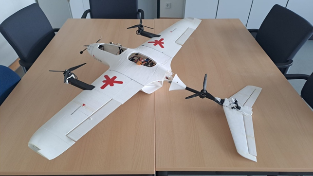
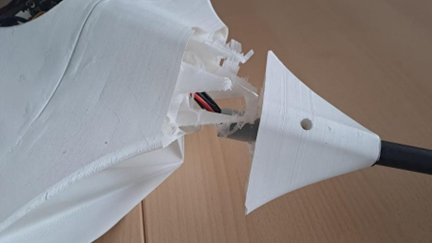
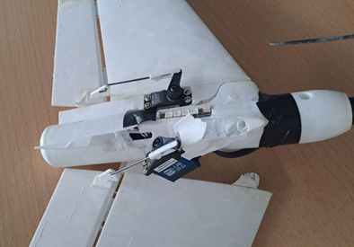

# 🚁 Stallion VTOL – Repair Guide

## Fuselage
- Disconnect all electrical connections to tail and wings (connector plugs inside fuselage) 
- Remove V-tail and wing panels
- Carefully remove the damaged rear fuselage segment (cut or grind)
- Print a new segment
- Align new segment precisely, and bond structurally
- Reconnect all cables, reattach wings and V-tail

## Tail
1. Remove servos carefully and disconnect the LED unit. 
2. Open the tail for access. Two options:
- *Option A:* Mechanically remove the tail elements to conserve the cables 
- *Option B:* Disconnect cables (by cutting) and reconnect later by soldering on modular connectors
3. Remove the tail
4. Print a new tail and equip with servos and LEDs. Two tail variants available:
- **"Existing" Variant 1** — heavier, greater structural strength, also serves as counterweight to the front-heavy battery
- **Variant 2** — lighter, lower structural rigidity
5. Reroute all Cables 
6. Mount Tail and secure all components 

## Full System Check
1. Verify functionality of all motors and propellers
2. Check structural integrity of the fuselage, thouroughly check for any remaining damage
3. Check stability of the full assembly, 
4. Check correct function of all electronics and RC channels. 
5. All subsequent flights to be conducted with minimum two people 

- pilot 
- spotter/technician

Optimally an additional person should available to act as "media" responsible - taking pictures / making videos as this could prove valuable for future documentation / evalution of crashs

*Source: Personal experience, HSRM Avionics project, Summer Semester 2025*
